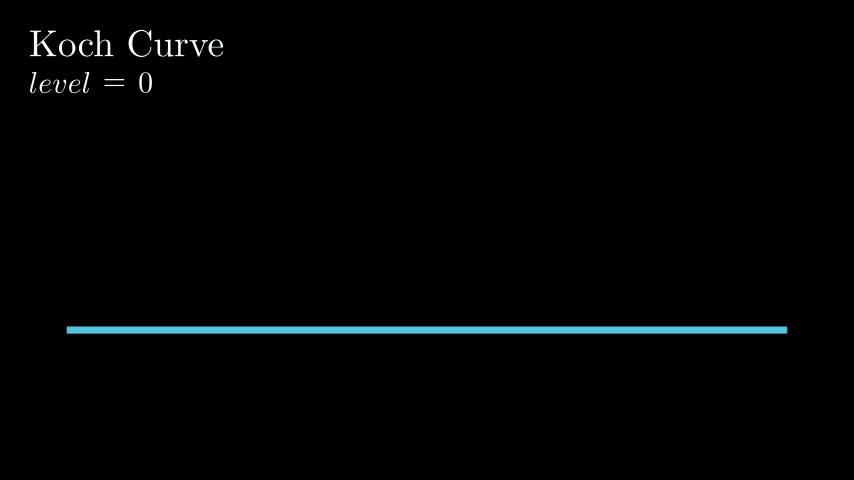

# Fractals

Repository about fractals generated using the [Manim library](https://github.com/manimCommunity/manim) 
v0.18.0.post0.

## Sierpinski

### Sierpinski chaos

Sierpinski triangle constructed using the chaos game. It consist on starting with the midpoint of an equilateral triangle and then at each iteration adding the middle point between that point and a random vertex

## Koch curve

## Run

    manim script.py Class -pql --format=gif

## Install

Installed using miniforge